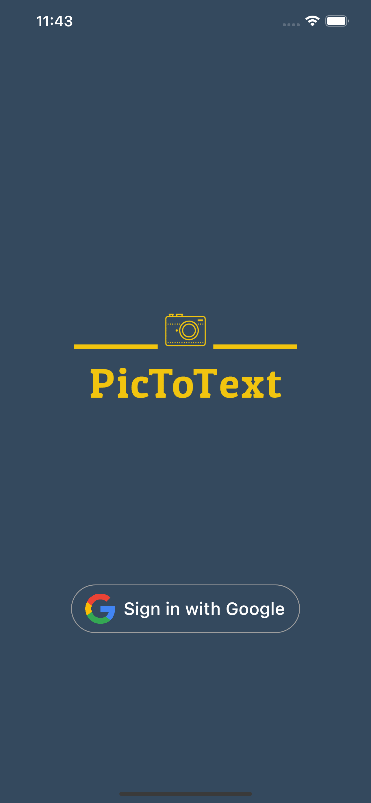
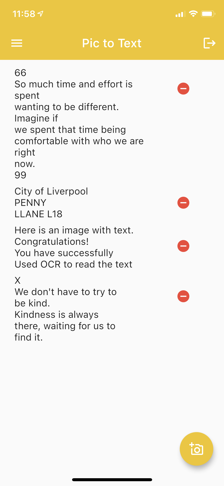
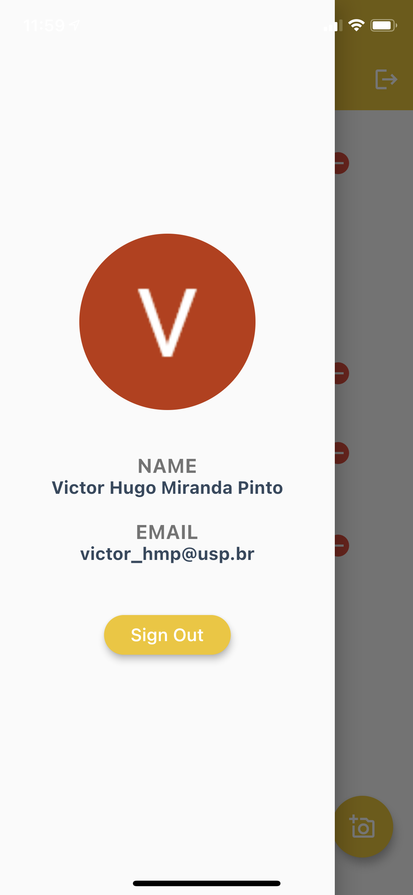
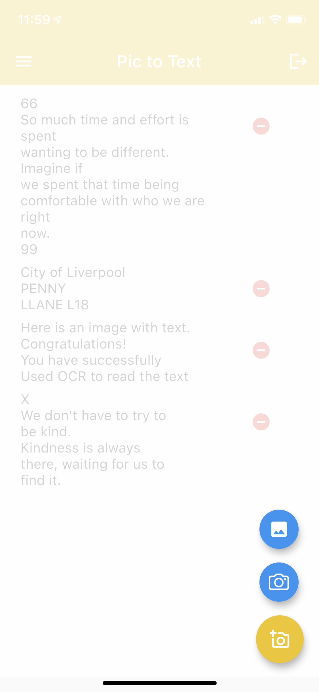
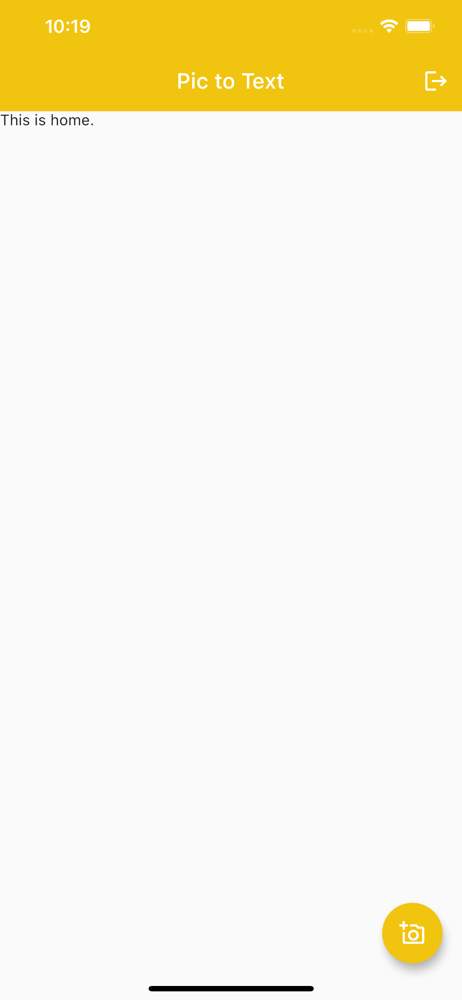
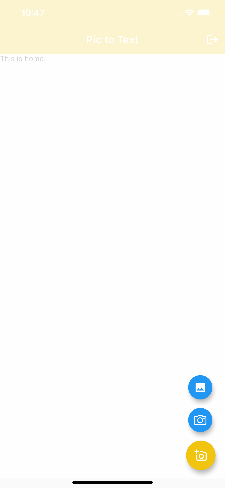
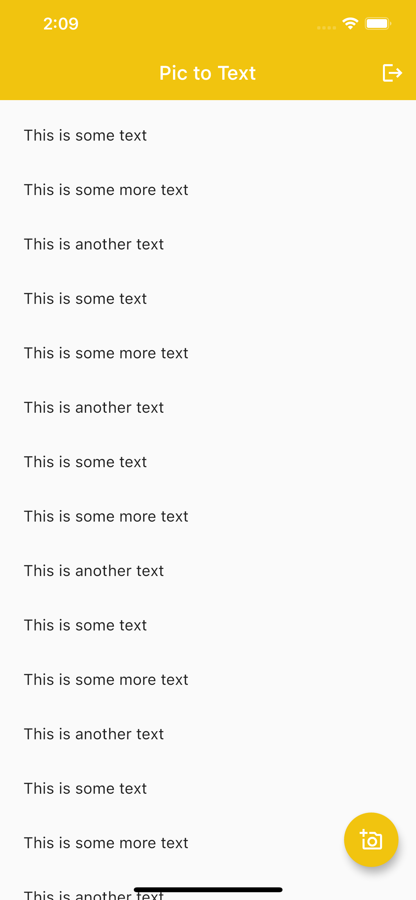
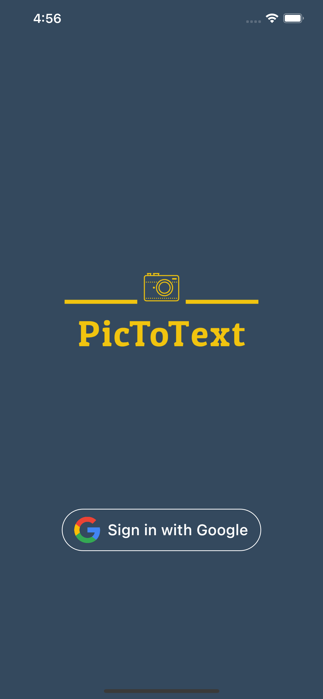

# PicToText - Tutorial de desenvolvimento

> Todos os passos descritos neste tutorial, e a sua elaboração,  foram feitos por Victor Hugo M. Pinto.
>
> Este tutorial está disponível em: https://github.com/victorhmp/pic-to-text/blob/main/tutorial/Tutorial.md.
>
> O resultado final está disponível no mesmo repositório, em: https://github.com/victorhmp/pic-to-text.

Neste tutorial, vamos aprender como desenvolver um aplicativo para iOS capaz de reconhecer texto em imagens. As principais funcionalidades desse aplicativo, que vamos focar no tutorial são as seguintes:

- Uso de Flutter, que permite facilmente o desenvolvimento do mesmo aplicativo em versões para Android ou até para a Web. Apesar deste tutorial focar em específico na criação do app para iOS, você vai ver que o processo para desenvolver a mesma aplicação pensando no Android é basicamente o mesmo.
- Armazenamento de dados na nuvem, por meio do módulo *Firestore*, também do Google Firebase. Aliado à funcionalidade de login, esse armazenamento em nuvem nos permite separar os dados salvos *por usuário*.
- Reconhecimento de texto em imagens utilizando o ML Kit, solução da Google para aprendizado de máquina **local**, ou seja, no dispositivo.
- Login com o Google, por meio do módulo de autenticação do Google Firebase.

As imagens abaixo mostram o estado final do app rodando em um iPhone.

<div style="display: 'flex'">
  
	
  
  
</div>

## Setup e ferramentas

Esta é a sessão menos divertida de qualquer tutorial, mas precisamos garantir que temos um setup funcionando bem para facilitar nosso fluxo de desenvolvimento.

As instruções abaixo são baseadas no setup em um computador rodando macOS, até por este ser um pré-requisito para o desenvolvimento de apps para iOS. Apesar disso, em computadores com Windows ou Linux, o setup não é muito diferente, e é muito bem descrito na documentação oficial das ferramentas.

### Flutter + Xcode

Vamos começar com o [**Flutter**](https://flutter.dev/), um *toolkit* criado e mantido pela Google que nos permite o desenvolvimento de aplicações para dispositivos móveis (iOS e Android), para a Web ou para *desktop*s utilizando a mesma base de código. Um grande diferencial do Flutter para outras soluções de desenvolvimento *mobile* para múltiplas plataformas é que aplicações criadas com Flutter são compiladas para código nativo, e sua performance não é negativamente impactada por *runtimes* ou *web views* sendo utilizadas para renderizar o app. Apps criados com Flutter são indiscerníveis de apps criados com Swift (iOS) ou Kotlin/Java (Android).

As instruções completas para instalação em qualquer SO podem ser encontradas em: [Install - Flutter](https://flutter.dev/docs/get-started/install ). Vou descrever rapidamente cada um dos passos, com algumas recomendações.

1. Baixar o Flutter SDK, disponível na página de instalação. É importante usar o link direto da página oficial para evitar problemas. Não recomendo usar a alternativa descrita, que envolve clonar o repositório do GitHub e utilizar a versão estável direto de lá. Note que o arquivo baixado é um `.zip`.

2. Descomprima o arquivo `.zip` na localização onde pretende deixá-lo. No macOS, basta clicar duas vezes no arquivo e será criada uma pasta de mesmo nome ao lado do `.zip`. Essa pasta resultante contém tudo o que o Flutter precisa para funcionar, inclusive seu binário.

3. Vamos adicionar o Flutter ao `PATH` do seu *shell*, para facilitar o desenvolvimento. Este passo pode variar ligeiramente dependendo do *shell* que você usa. Nas versões mais recentes do macOS, o *shell* padrão é o *zsh*. Nesse caso, basta adicionar a seguinte linha ao arquivo `$HOME/.zshrc`:

   ```shell
   export PATH="$PATH:[CAMINHO PARA A PASTA FLUTTER CRIADA NO PASSO ANTERIOR]/flutter/bin"
   ```

   Se estiver usando `bash`, a mesma linha deve funcionar, porém ela deve ser adiciona ao arquivo `$HOME/.bash_profile` ou `$HOME/.bashrc`.

   Para atualizar sua sessão atual do shell, execute:

   ```shell
   $ source $HOME/.<arquivo_de_configuração_modificado>
   ```

   Agora basta verificar se `flutter/bin` de fato está no seu PATH:

   ```shell
   $ echo $PATH
   ```

   E podemos verificar que o comando `flutter` está funcionando executando:

   ``` shell
   $ which flutter
   ```

Agora já conseguimos executar comandos do Flutter! Vamos agora fazer o setup do Xcode para podermos desenvolver para o iOS. Não vou comentar sobre o setup para desenvolvimento para Android, mas ele está na [mesma página da documentação do Flutter](https://flutter.dev/docs/get-started/install/macos#android-setup), e é tão simples quanto o do iOS, podendo ser feito em **qualquer** SO.

1. Primeiro precisamos instalar o Xcode. Isso pode ser feito pela [Mac App Store](https://apps.apple.com/br/app/xcode/id497799835?l=en&mt=12). O download é bem grande, cerca de 11Gb, então pode demorar dependendo da sua internet.

2. Uma vez que o Xcode está instalado, vamos configurar o *Xcode command-line tools* para utilizar a versão do Xcode que acabou de ser instalada:

   ```shell
   $ sudo xcode-select --switch /Applications/Xcode.app/Contents/Developer
   $ sudo xcodebuild -runFirstLaunch
   ```

3. Agora, com o Xcode instalado, temos tudo o que precisamos para desenvolver para iOS! Você pode verificar que tudo está correto com o comando:

   ```shell
   $ flutter doctor
   ```

   Também já podemos deixar um simulador de iOS aberto, ele será muito útil durante o desenvolvimento:

   ```shell
   $ open -a Simulator
   ```

### VSCode

Esta parte do tutorial é totalmente opcional, mas recomendo o uso do VSCode para desenvolvimento. Mais informações sobre ele podem ser encontradas no [site oficial](https://code.visualstudio.com/), e seu download também.

O time do Fluter criou plugins do VSCode excelentes para ajudar com o desenvolvimento. Para instalá-los:

1. Abra o VSCode
2. Abra a *command palette* pelo atalho `cmd + shift + p` ou pela barra de menu, em **View > Command Palette...**.
3. Comece a digitar "install" e selecione a opção **Extensions: Install Extensions**.
4. Digite "flutter" e instale a extensão **Flutter** na lista. Isso vai instalar também uma extensão para a linguagem **Dart**, utilizada no desenvolvimento com Flutter.

### Validando o setup de desenvolvimento

Agora que fizemos todo o setup local de desenvolvimento, vamos rapidamente testá-lo para garantir que não vamos ter problemas durante os próximos passos. Vamos criar o nosso projeto Flutter e executá-lo no simulador iOS pela primeira vez!

1. Vá até o diretório em que pretende desenvolver o app, e execute o seguinte comando para criar um novo projeto Flutter:

   ```shell
   $ flutter create pic_to_text
   ```

   Este comando vai criar um novo diretório chamado `pic_to_text`, com um projeto Flutter já funcional dentro.

2. Navegue até o diretório criado e execute o projeto, com o comando:

   ```shell
   $ flutter run
   ```

   Este comando faz o *build* do projeto, e o executa em um dispositivo compatível conectado ao computador, no nosso caso o próprio simulador.

### Firebase

O próximo passo é configurar o Firebase, que vamos utilizar para cuidar da autenticação e do armazenamento de dados da nossa aplicação.

Não precisamos fazer o setup completo agora, mas vamos pelo menos fazer o primeiro login e criar um novo projeto no Firebase.

1. Acesse https://firebase.google.com/.
2. Faça login com a sua conta do Google
3. Você deverá ter sido levado para o *console*. Aqui é onde você pode ver todos os seus projetos que utilizam o Firebase.
4. Clique em "Adicionar projeto"
5. Dê um nome para o projeto, no caso do tutorial, "PicToText"
6. Recomendo não ativar o Analytics pois não vamos utilizá-lo.

Pronto! Agora já temos um projeto criado no Firebase! Vamos voltar a usar e modificar este projeto ao longo do desenvolvimento do projeto conforme adicionamos novas funcionalidades no app.

## Interagindo com a câmera e a galeria de imagens do dispositivo

Bom, depois de todo esse setup, vamos começar a programar! A primeira parte do desenvolvimento do app vai ser criar uma interface inicial simples e permitir que um usuário selecione uma imagem da sua galeria ou tire uma nova foto com a câmera.

### Primeira iteração da interface

Vamos criar a primeira tela básica do app, que será a nossa tela inicial por enquanto. Essa primeira tela mostrará o histórico de consultas feitas pelo usuário até o momento, e apresentará um botão que permite que ele realize uma nova consulta, usando a câmera do celular ou a galeria de imagens.

1. Primeiro, vamos instalar as dependências que precisamos. Adicione o seguinte no arquivo `pubspec.yaml`:

   ```yaml
   dependencies:
     image_picker: ^0.6.7+14
     flutter_speed_dial: ^1.2.5
   ```

   Se você estiver usando o VSCode com a extensão do Flutter, essa alteração fará com que as dependências já sejam instaladas no seu projeto assim que o arquivo for salvo. Caso contrário, execute o seguinte comando:

   ```shell
   flutter pub get
   ```

   A [image_picker](https://pub.dev/packages/image_picker) vai nos permitir escolher uma imagem, e a [flutter_speed_dial](https://pub.dev/packages/flutter_speed_dial) vamos usar para mostrar o botão de realização de novas consultas.

2. Crie um novo arquivo `pic_to_text/lib/HomePage.dart`;

3. Crie um *stateful widget* e importe `package:flutter/material.dart`. Se estiver usando o VSCode, basta digitar `st` e selecionar "Flutter Stateful Widget" do dropdown. O estado do arquivo deve ser o seguinte:

   ```dart
   import 'package:flutter/material.dart';
   
   class HomePage extends StatefulWidget {
     @override
     _HomePageState createState() => _HomePageState();
   }
   
   class _HomePageState extends State<HomePage> {
     @override
     Widget build(BuildContext context) {
       return Container(
         
       );
     }
   }
   ```

4. Vamos preencher essa tela! Importe as bibliotecas que instalamos no passo 1:

   ```dart
   import 'package:flutter_speed_dial/flutter_speed_dial.dart';
   import 'package:image_picker/image_picker.dart';
   ```

5. Substitua a sua função `build` pelo seguinte:

   ```dart
     @override
     Widget build(BuildContext context) {
       return Scaffold(
         appBar: AppBar(
           elevation: 0,
           title: Text('Pic to Text'),
           backgroundColor: Color(0xFFf1c40f),
           actions: [
             IconButton(
               onPressed: () {},
               icon: Icon(Icons.logout),
             )
           ],
         ),
         body: Text('This is home.'),
         floatingActionButton: SpeedDial(
           child: Icon(Icons.add_a_photo_outlined),
           backgroundColor: Color(0xFFf1c40f),
           children: [
             SpeedDialChild(
               child: Icon(CupertinoIcons.camera),
               onTap: () {},
             ),
             SpeedDialChild(
               child: Icon(Icons.image),
               onTap: () {},
             ),
           ],
         ),
       );
     }
   ```

5. Substitua o conteúdo do arquivo `lib/main.dart` para conseguir ver a página inicial que estamos construindo:

   ```dart
   import 'package:flutter/material.dart';
   
   import 'package:pic_to_text/HomePage.dart';
   
   void main() {
     runApp(MyApp());
   }
   
   class MyApp extends StatelessWidget {
     // This widget is the root of your application.
     @override
     Widget build(BuildContext context) {
       return MaterialApp(
         title: 'Pic to Text',
         debugShowCheckedModeBanner: false,
         home: HomePage(),
       );
     }
   }
   ```

   Quando salvar este arquivo, seu app deve mostrar o seguinte:

    

### Escolhendo uma imagem

Por enquanto nosso app não faz nada, só tem uma interface bonitinha. Vamos mudar isso!

1. Crie um método privado dentro de `_HomePageState` que vai ser responsável pela lógica de selecionar a imagem e salvar no estado do componente o `path` dela:

   ```dart
   // import da biblioteca de I/O do Dart
   import 'dart:io';
   
   // ...
   
   // variáveis de estado
   final ImagePicker picker = ImagePicker();
   File _userImageFile;
   
   // método responsável por lidar com a seleção de imagem
   void _pickImage(ImageSource imageSource) async {
       final pickedImageFile = await picker.getImage(
         source: imageSource,
       );
   
       if (pickedImageFile != null) {
         setState(() {
           _userImageFile = File(pickedImageFile.path);
         });
       } else {
         print('No image was selected');
       }
     }
   ```

2. Vamos fazer os botões de ação usarem a função acima para deixar que o usuário selecione uma imagem:

   ```diff
        floatingActionButton: SpeedDial(
           child: Icon(Icons.add_a_photo_outlined),
           backgroundColor: Color(0xFFf1c40f),
           children: [
             SpeedDialChild(
               child: Icon(CupertinoIcons.camera),
   +            onTap: () {
   +              _pickImage(ImageSource.camera);
   +            },
             ),
             SpeedDialChild(
               child: Icon(Icons.image),
   +            onTap: () {
   +              _pickImage(ImageSource.gallery);
   +            },
             ),
           ],
         ),
   ```

3. Como é comum em qualquer app mobile, precisamos pedir permissão doo usuário para conseguir usar tanto a câmera do dispositivo quanto a galeria. Basta adicionar o seguinte no arquivo `pic_to_text/ios/Runner/Info.plist`:

   ```xml
   <key>NSCameraUsageDescription</key>
   <string>Take a picture to recognize text from</string>
   <key>NSPhotoLibraryUsageDescription</key>
   <string>Load images to recognize text</string>
   ```

   Com isso, o app vai pedir a permissão do usuário para usar a câmera e a galeria de fotos. É tudo o que precisamos para ler imagens!

## Reconhecendo texto

Agora que já conseguimos receber imagens, vamos reconhecer texto nelas!

### Preparando a interface

Vamos primeiro preparar a interface para mostrar o histórico de consultas feitas anteriormente pelo usuário do nosso app e, após uma nova entrada, se atualiza.

1. Crie um novo arquivo `lib/mockHistory.dart` e coloque nele o seguinte:

   ```dart
   const mockHistory = [
     'This is some text',
     'This is some more text',
     'This is another text',
     'This is some text',
     'This is some more text',
     'This is another text',
     'This is some text',
     'This is some more text',
     'This is another text',
     'This is some text',
     'This is some more text',
     'This is another text',
     'This is some text',
     'This is some more text',
     'This is another text',
     'This is some text'
   ];
   ```

   Essa é uma lista *mock* que irá representar o nosso histórico por enquanto.

2. Em `HomePage.dart`, importe o arquivo que acabamos de criar (`import 'package:pic_to_text/mockHistory.dart'`) e crie um novo widget chamado `History`, dessa vez *stateless*:

   ```dart
   
   import 'package:pic_to_text/mockHistory.dart' as mock;
   
   // ...
   
   class History extends StatelessWidget {
     History({
       Key key,
       @required this.history,
     }) : super(key: key);
   
     final history;
   
     @override
     Widget build(BuildContext context) {
       return ListView.builder(
           padding: const EdgeInsets.all(8),
           itemCount: this.history.length,
           itemBuilder: (BuildContext context, int index) {
             return ListTile(
               title: Text('${this.history[index]}'),
               onTap: () {},
             );
           });
     }
   }
   ```

   Esse widget é responsável por receber um histórico, em forma de lista de *strings* e renderizá-lo como uma lista rolável na interface.

3. Ainda no mesmo arquivo, faça a seguinte alteração:

   ```diff
   return Scaffold(
         appBar: AppBar(
           elevation: 0,
           title: Text('Pic to Text'),
           backgroundColor: Color(0xFFf1c40f),
           actions: [
             IconButton(
               onPressed: () {},
               icon: Icon(Icons.logout),
             )
           ],
         ),
   -     body: Text('This is home.'),
   +     body: History(history: history),
         floatingActionButton: SpeedDial(
   ```

   Agora o seu app deve estar assim:

   

4. Vamos também criar uma função dentro da classe `HomePageState` que vai permitir a adição de itens no histórico:

   ```dart
   // cópia local do histórico
   List<String> history = mock.mockHistory;
   
   void _addToHistory(String text) {
     setState(() {
         history = [text] + history;
     });
   }
   ```

   Por agora essa é uma função bem simples, mas vamos torná-la mais sofisticada mais adiante.

### Adicionando Firebase

Agora vamos fazer com que o nosso app possa de fato usar o Firebase. Note que esses passos são específicos por plataforma. Para instruções referentes ao setup para outras plataformas, diferentes do iOS, visite a documentação do [FlutterFire](https://firebase.flutter.dev/docs/overview#installation).

1. Vá até o seu [console do Firebase](https://console.firebase.google.com/) e selecione o PicToText na lista de projetos;

2. Clique em "Adicionar app", na parte superior da tela, e selecione iOS;

3. No passo-a-passo, o primeiro item pedido é o "Código do pacote do iOS", e essa propriedade é definida no código do nosso app. Abra o diretório `pic_to_text/ios` no Xcode e vamos descobrir qual é o código do pacote;

4. No Xcode, selecione na barra lateral da esquerda o projeto "Runner". Na aba "General", o segundo item deve ser "Bundle Identifier". Esse é o código do seu pacote iOS. Você pode inclusive alterá-lo no Xcode mesmo. De qualquer forma, preencha o formulário na página do Firebase com esse código;

5. Clique em "Registrar app";

6. Faça o download do arquivo de configuração, e ignore os próximos passos do passo-a-passo do Firebase;

7. Agora volte ao Xcode, clique com dois dedos (equivalente a clicar com o botão direito do mouse) no projeto "Runner", e selecione a opção "Add files to Runner";

8. Selecione o arquivo de configuração que você acabou de baixar e confirme. Não vamos precisar mais do Xcode por enquanto;

9. Voltando ao seu editor de texto, adicione ao seu `pubspec.yaml` as dependências [firebase_core](https://pub.dev/packages/firebase_core) e [firebase_ml_vision](https://pub.dev/packages/firebase_ml_vision):

   ```yaml
   dependencies:
   	...
     firebase_core: "0.5.2"
     firebase_ml_vision: ^0.9.9
   ```

   Como sempre, execute `flutter pub get`, se o seu editor não fizer isso pra você;

### Usando o `firebase_ml_vision`

Agora, finalmente, vamos implementar a funcionalidade de reconhecimento de texto no app!

1. Em `lib/HomePage.dart`,  importe a biblioteca e adicione a seguinte função dentro da classe `_HomePageState`:

   ```dart
   import 'package:firebase_ml_vision/firebase_ml_vision.dart';
   
   // ...
   
   void recogniseText() async {
       FirebaseVisionImage myImage = FirebaseVisionImage.fromFile(_userImageFile);
       TextRecognizer recognizeText = FirebaseVision.instance.textRecognizer();
       VisionText readText = await recognizeText.processImage(myImage);
   
       _addToHistory(readText.text);
   
       setState(() {
         _userImageFile = null;
       });
     }
   ```

   Essa é a função que vamos chamar para reconhecer o texto em uma imagem e adicionar o resultado ao nosso histórico;

2. Agora basta chamar a função assim que o usuário escolher uma imagem. Ainda no mesmo arquivo, adicione o seguinte dentro da função `_pickImage`:

   ```diff
   void _pickImage(ImageSource imageSource) async {
       final pickedImageFile = await picker.getImage(
         source: imageSource,
       );
   
       if (pickedImageFile != null) {
         setState(() {
           _userImageFile = File(pickedImageFile.path);
         });
         
         print('User selected image.');
   +
   +     await recognizeText();
       } else {
         print('No image was selected');
       }
     }
   ```

3. Para o reconhecimento funcionar corretamente no iOS, adicione as seguintes linhas no arquivo `lib/ios/Podfile`:

   ```ruby
   pod 'Firebase/MLVisionBarcodeModel'
   pod 'Firebase/MLVisionFaceModel'
   pod 'Firebase/MLVisionLabelModel'
   pod 'Firebase/MLVisionTextModel'
   ```

   Depois disso, navegue até `lib/ios` pelo terminal e execute `pod update`.

## Checkpoint 1

Ufa! Já fizemos bastante coisa! Este é o primeiro *checkpoint* do tutorial, e o objetivo desta sessão é verificar se estamos andando juntos até agora. 

Neste momento, há duas partes principais para garantir que está tudo indo bem:

1. Seu setup está funcionando bem e você consegue executar e desenvolver a app com Flutter, em um simulador iOS sem problemas;
2. Um usuário do seu app já consegue ver a lista de consultas que ele fez e realizar uma nova consulta usando imagens da galeria ou da câmera do celular. Novas consultas são adicionadas ao topo do histórico.

Se ambas as afirmações são verdadeiras pro seu caso, está tudo certo! Vamos para os próximos passos :)

## Login com Google

Agora o próximo passo no nosso app é adicionar autenticação, usando o [Firebase Auth](https://firebase.google.com/docs/auth). Vamos implementar apenas a autenticação que utiliza contas da Google, ou seja, usuários vão acessar o app usando suas contas da Google.

Esta foi a parte mais difícil durante o desenvolvimento, pois possui algumas particularidades e a documentação não é tão clara. Vou fazer o meu melhor para facilitar o passo-a-passo.

### Página de login

Vamos começar pela interface e criar a página de login do nosso app.

1. Criei o arquivo `lib/LoginPage.dart` e preencha-o com o código:

   ```dart
   import 'package:flutter/material.dart';
   
   class LoginPage extends StatefulWidget {
     @override
     _LoginPageState createState() => _LoginPageState();
   }
   
   class _LoginPageState extends State<LoginPage> {
     @override
     Widget build(BuildContext context) {
       return Scaffold(
         body: Container(
           color: Color(0xFF34495e),
           child: Center(
             child: Column(
               mainAxisSize: MainAxisSize.max,
               mainAxisAlignment: MainAxisAlignment.center,
               children: <Widget>[
                 Image(
                   image: AssetImage("assets/logo.png"),
                 ),
                 SizedBox(height: 50),
                 _signInButton(),
               ],
             ),
           ),
         ),
       );
     }
     
     Widget _signInButton() {
       return OutlineButton(
         splashColor: Colors.grey,
         onPressed: () {},
         shape: RoundedRectangleBorder(borderRadius: BorderRadius.circular(40)),
         highlightElevation: 0,
         borderSide: BorderSide(color: Colors.white),
         child: Padding(
           padding: const EdgeInsets.fromLTRB(0, 10, 0, 10),
           child: Row(
             mainAxisSize: MainAxisSize.min,
             mainAxisAlignment: MainAxisAlignment.center,
             children: <Widget>[
               Image(image: AssetImage("assets/google_logo.png"), height: 35.0),
               Padding(
                 padding: const EdgeInsets.only(left: 10),
                 child: Text(
                   'Sign in with Google',
                   style: TextStyle(
                     fontSize: 20,
                     color: Colors.white,
                   ),
                 ),
               )
             ],
           ),
         ),
       );
     }
   }
   ```

   Note que por enquanto este código não vai funcionar, pois as imagens que ele tenta utilizar não existem no projeto.

2. Baixe a pasta `assets` disponível em: https://drive.google.com/drive/folders/1f_N45Nxw6bC-oNVCZkTr5oRho5oJJc-3?usp=sharing;

3. Mova a pasta `assets` para a raíz do diretório `pic_to_text`;

4. Adicione o seguinte no arquivo `pubspec.yaml`:

   ```yaml
   # The following section is specific to Flutter.
   flutter:
     uses-material-design: true
     assets:
       - google_logo.png
       - logo.png
   ```

5. Para verificar como está a tela de login, faça a seguinte mudança em `lib/main.dart`:

   ```diff
     Widget build(BuildContext context) {
       return MaterialApp(
         title: 'Pic to Text',
         debugShowCheckedModeBanner: false,
   -      home: HomePage(),
   +      home: LoginPage(),
       );
     }
   ```

   A página de login do seu app deve estar como essa:

   

### Usando o `firebase_auth`


## Checkpoint 2

## Armazenando dados na nuvem

## Checkpoint 3

## Próximos passos

## Comentários finais (para o professor)


